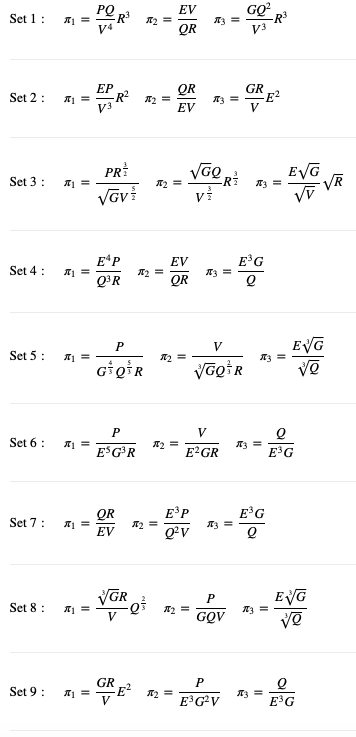

# BuckinghamPy

 ## Use our new web app!
 <a href="https://saadgroup.a2hosted.com/bham"> 
  
 </a> (Launch GUI App)
 
[Watch the youtube video](https://youtu.be/WGoOQh2MPHI)

<br>
<br>

You can calso use the deprecated GUI interface via binder
[](https://mybinder.org/v2/gh/saadgroup/BuckinghamPy/master?filepath=examples.ipynb) (Jupyter Notebook Examples)

## Description
BuckinghamPy is a Python code that implements the Buckingham-Pi theorem and returns all possible sets of dimensionless groups.

The methodology is discussed in the original artictle: https://www.sciencedirect.com/science/article/pii/S2352711021001291

Cite as: Karam, M., & Saad, T. (2021). BuckinghamPy: A Python software for dimensional analysis. SoftwareX, 16, 100851.

## Installation
---
Clone the package from the github repository into the current directory
```buildoutcfg
git clone https://github.com/saadgroup/BuckinghamPy.git BuckinghamPy
```
Now change directory to the git repo
```buildoutcfg
cd BuckinghamPy
```
Use `pip` to install the package in the active python evironment
```buildoutcfg
pip install .
```
Note that last two steps - you must change directories to the repo directory and call `pip` from within it.
## Example

Consider a fluid with density R and viscosity V, pumped in a centrifugal pump with power input P, a volume flow rate Q, an impeller diameter E, and a rotational rate G.

The homogeneous function that relates all these variables is: f(R, V, P, Q, E, G) = 0 
  
Using the fundamental units (M, L, T), find all the sets of dimensionless terms with the power input P being part of only one dimensionless term per set.  

Using BuckinghamPy, we execute the following code:

```buildoutcfg
from buckinghampy import BuckinghamPi

Example = BuckinghamPi()
Example.add_variable(name='R', dimensions='M/L^(3)')
Example.add_variable(name='P', dimensions='M*L^(2)/(T^3)', non_repeating=True)
Example.add_variable(name='V', dimensions='M/(T*L)')
Example.add_variable(name='Q', dimensions='L^(3)/T')
Example.add_variable(name='E', dimensions='L')
Example.add_variable(name='G', dimensions='1/T')

Example.generate_pi_terms()

Example.print_all()
```


or you can import the graphic user interface only in a Jupyter cell
```buildoutcfg
from buckinghampy import BuckinghamPiGui

GUI=BuckinghamPiGui()
```

---
## See Also

* [Documentation](https://htmlpreview.github.io/?https://github.com/saadgroup/BuckinghamPy/blob/master/doc/buckinghampi.m.html)
--- 
